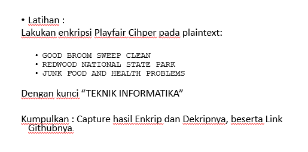

	KRIPTOGRAFI

	TUGAS PRAKTEK PLAYFAIR CHIPER

	Dosen Pengampu : Ahmad Turmudizy,S.Kom.,M.Kom

 
	<b>Tugas untuk memenuhi syarat penilain pada Pert-6</b>

	

                 Nama  : Jose Fisto

                 NIM   : 312010119

                 Kelas : TI.20 A.1

 
 

	<b>UNIVERSITAS PELITA BANGSA</b>

	<b>FAKULTAS TEKNIK</b>

	<b>TEKNIK INFORMATIKA</b>

	<b>TA 2020 / 2021</b>

  

  

	

